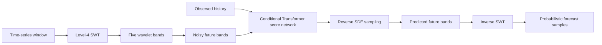

# Wavelet Diffusion for Probabilistic Time-Series Forecasting

This project studies a diffusion model for probabilistic forecasting of financial time series.
The model combines a Transformer score network with a stationary wavelet transform (SWT).
The wavelet representation separates a time series into components at multiple temporal scales.
The diffusion process generates plausible future trajectories from noisy wavelet coefficients.

The repository contains the model, training code, inverse-SWT reconstruction, rolling-origin evaluation, baseline methods, and unit tests.
The current-code five-epoch run validates the pipeline only.
It does not provide a final estimate of model quality.

## 1. Introduction

Time-series forecasting estimates future observations from a finite history.
Financial time series make this task difficult because they contain noise, changing volatility, and weakly stable temporal structure.
Point forecasts hide this uncertainty by returning one trajectory.
Probabilistic forecasts represent uncertainty with an ensemble of future trajectories.

Diffusion models provide one approach to probabilistic generation.
They define a forward process that gradually adds noise to data, then learn a reverse process that removes noise.
The reverse process starts from Gaussian noise and produces samples from the learned data distribution.
This project applies that idea to future windows of a time series.

The project uses wavelets because temporal patterns occur at different scales.
An SWT decomposes a signal into detail bands and a coarse approximation band.
The model predicts all future bands, then reconstructs the future signal with the inverse SWT.

## 2. Diffusion background

Let $x_0$ denote a clean data sample.
The forward diffusion process defines increasingly noisy variables:

$$
q(x_t \mid x_{t-1}) = \mathcal{N}\left(x_t; \sqrt{1-\beta_t}\,x_{t-1},\; \beta_t I\right),
\qquad t = 1, \ldots, T.
$$

Here, $\beta_t$ controls the noise added at step $t$.
With $\bar{\alpha}_t = \prod_{s=1}^{t}(1-\beta_s)$, the noisy sample has the closed form:

$$
x_t = \sqrt{\bar{\alpha}_t}\,x_0 + \sqrt{1-\bar{\alpha}_t}\,\epsilon,
\qquad \epsilon \sim \mathcal{N}(0,I).
$$

The reverse model learns a score or a noise estimate that identifies the direction toward less noisy data.
At inference time, the sampler starts with $x_T \sim \mathcal{N}(0,I)$ and applies the learned reverse dynamics.
The DDPM formulation provides the foundation for this denoising procedure ([Ho et al., 2020](https://arxiv.org/abs/2006.11239)).


*Figure 1. A visual analogy for the forward diffusion process.*
The figure uses a video-like frame to show progressive noise addition.
This project applies the same idea to numerical time-series windows and wavelet coefficients.

## 3. Wavelet representation

For an input window $y \in \mathbb{R}^{L}$, the level-four SWT with the Daubechies-4 wavelet produces four detail bands and one approximation band:

$$
\mathcal{W}(y) = \left[cD_1, cD_2, cD_3, cD_4, cA_4\right].
$$

The transform preserves the time-aligned structure of the signal.
The detail bands represent changes at different scales.
The approximation band represents the coarser signal structure.
The implementation pads windows to a length divisible by $2^4$ when required.
The inverse SWT removes this padding after reconstruction.

The model receives tensors with shape $[N, L, 5, 1]$.
Here, $N$ is the number of windows, $L$ is the window length, and the five bands are the wavelet channels.
The model predicts the future portion of every band.
The inverse transform combines the predicted bands into a forecast in the original signal domain.

## 4. Conditional forecasting model

Given a history window $y_{1:H}$, the model generates samples for the future horizon $y_{H+1:H+K}$.
The Transformer score network receives the observed history, noisy future coefficients, diffusion time, and guidance information.
The reverse SDE generates a sample of future wavelet coefficients.
The inverse SWT maps that sample back to the signal domain.

The training objective combines a score-matching term with a multiscale reconstruction term:

$$
\mathcal{L}
= \mathcal{L}_{\mathrm{score}}
  + \lambda_{\mathrm{wavelet}}\mathcal{L}_{\mathrm{wavelet}}.
$$

The score term trains the diffusion model to estimate the denoising direction.
The wavelet term preserves consistency across the predicted frequency bands.
The implementation uses a variance-preserving SDE and a Transformer score network.



## 5. Data and experimental protocol

The project uses Bitcoin price data and models log returns rather than raw prices.
The data pipeline creates training and testing windows from local CSV files.
The default evaluation uses 50 observations of history and a 20-observation forecast horizon.

The rolling-origin evaluator prevents future observations from entering a forecast input.
At each origin, a forecast function receives only the preceding history window.
The evaluator reports mean absolute error (MAE), root mean squared error (RMSE), CRPS, and interval coverage.

The repository includes three simple baselines:

1. Zero return predicts a zero future return at every step.
2. Last return repeats the most recent observed return.
3. Historical bootstrap samples observed returns from the available history.

The baseline protocol uses 51 test origins, 100 samples for stochastic forecasts, and seed 42.

| Baseline | MAE | RMSE | CRPS | 50% coverage | 90% coverage | Origins |
| --- | ---: | ---: | ---: | ---: | ---: | ---: |
| Zero return | 0.01819 | 0.02508 | 0.01819 | 0.000 | 0.000 | 51 |
| Last return | 0.02473 | 0.03113 | 0.02473 | 0.000 | 0.000 | 51 |
| Historical bootstrap | 0.01841 | 0.02530 | 0.01413 | 0.485 | 0.864 | 51 |

These values are baseline measurements.
They do not represent a final diffusion-model result.

## 6. Qualitative results

Figure 2 shows the full price and wavelet-band history.
The vertical split separates the training and test ranges.
The lower panels show the detail and approximation bands used by the model.


*Figure 2. The Bitcoin price series, daily log returns, and five wavelet bands.*

Figures 3–5 show historical prediction outputs.
The blue line shows the history, the green line shows the true future, and the red dashed line shows the median prediction.
The shaded regions show the 80% interval and the interquartile range.
These figures demonstrate the forecast and uncertainty visualizations produced by the project.
They are qualitative historical outputs, not a controlled final benchmark.

| Forecast example | Artifact |
| --- | --- |
| Window 816 |  |
| Window 834 |  |
| Window 453 |  |

## 7. Reproducibility

Create the Conda environment and install the package:

```bash
conda env create -f environment.yml
conda activate wavelet-diff
pip install -e .
```

Run the tests and linter:

```bash
ruff check src data tests
pytest -q
```

Train the bounded CPU pilot:

```bash
python -m src.model.trainer --config configs/current_cpu_pilot.json
```

Run the rolling-origin baseline evaluation:

```bash
python -m src.benchmarks.rolling_baselines \
  --input data/Testing\ Data/bitcoin_raw_prices_test.csv \
  --output outputs/baseline_metrics.csv
```

Run model evaluation after training a compatible current-code checkpoint:

```bash
python -m src.benchmarks.model_rolling_evaluation \
  --checkpoint outputs/checkpoints/current_model.pth \
  --output outputs/model_metrics.csv
```

## 8. Limitations

The repository does not include a final current-code model quality table.
The available current-code run uses five epochs and acts as a pipeline smoke test.
The historical checkpoints require the historical model implementation because their parameter shapes do not match the current architecture.
Training and prediction require local data that the repository does not store.

## References

1. Ho, J., Jain, A., and Abbeel, P. *Denoising Diffusion Probabilistic Models*. 2020. [arXiv:2006.11239](https://arxiv.org/abs/2006.11239).
2. Nason, G. P. and von Sachs, R. *Wavelet Processes and Adaptive Estimation of the Evolutionary Wavelet Spectrum*. 1999. [Biometrika](https://doi.org/10.1093/biomet/86.4.873).

## License

This project is licensed under the MIT License. See [LICENSE](LICENSE).
