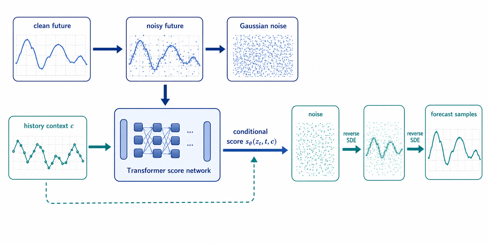
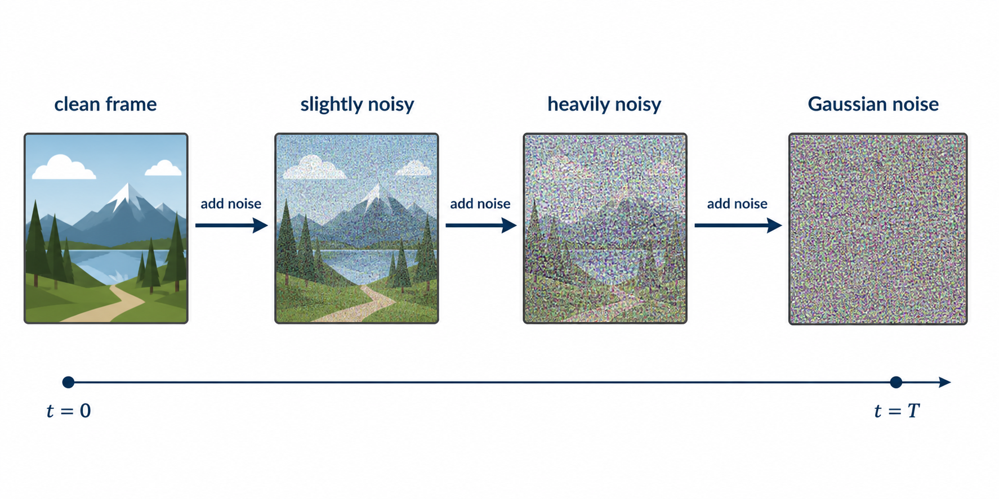
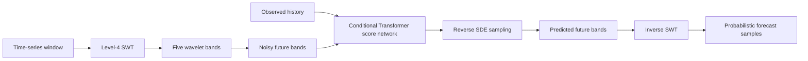
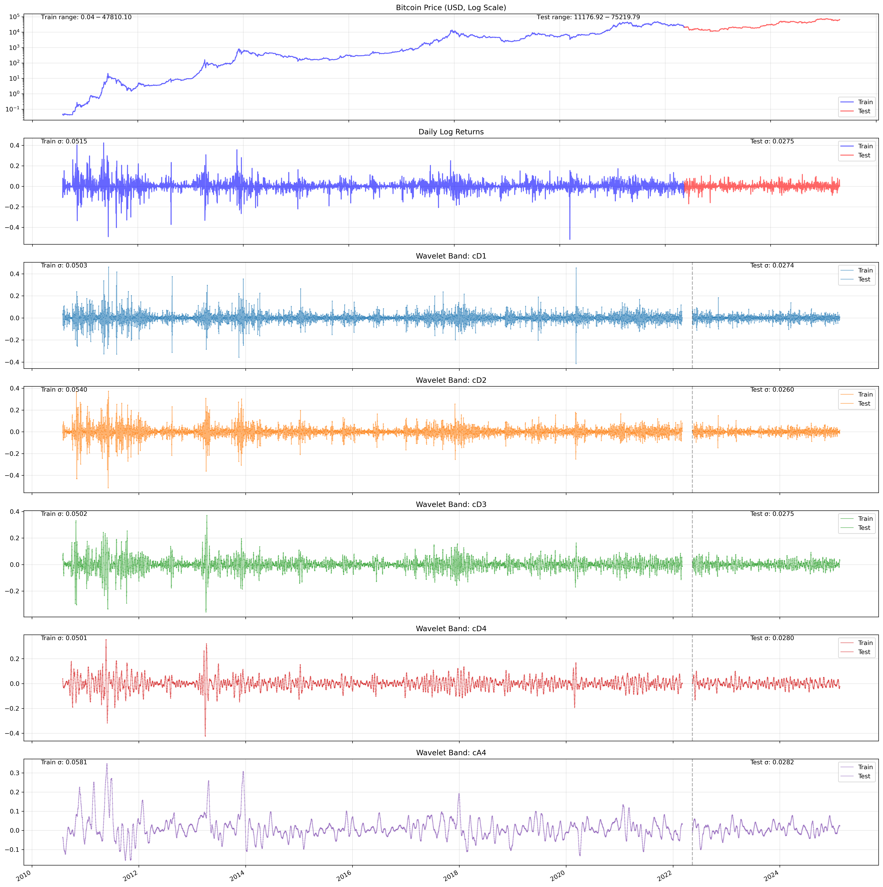
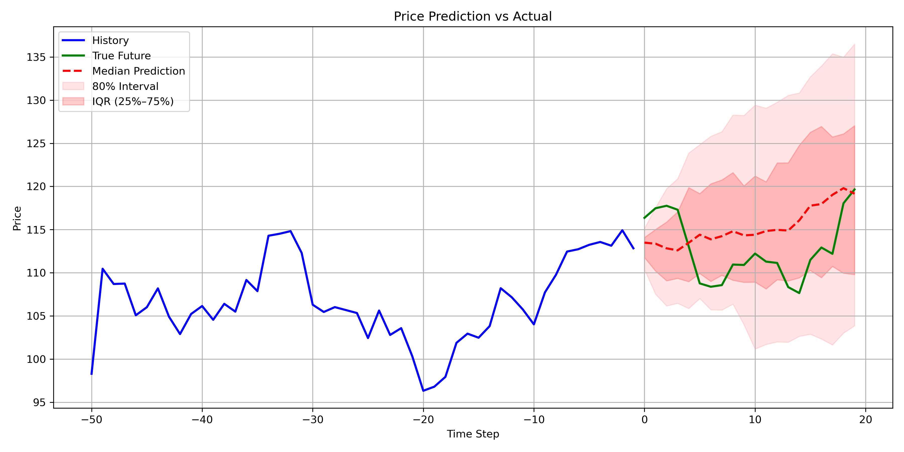
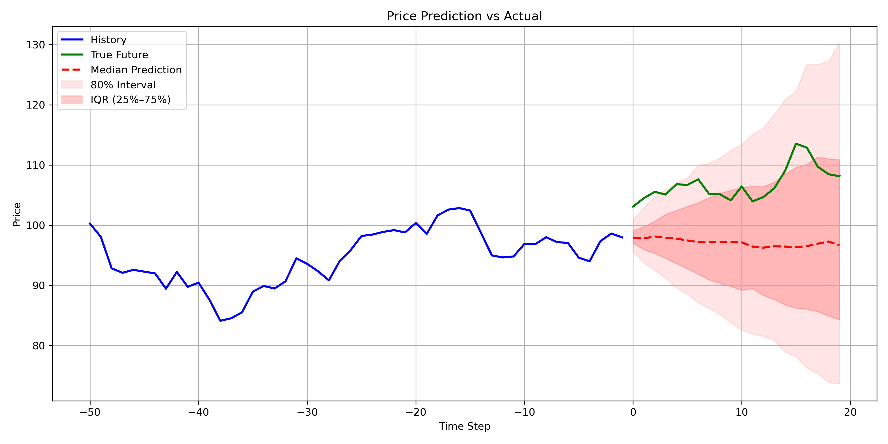
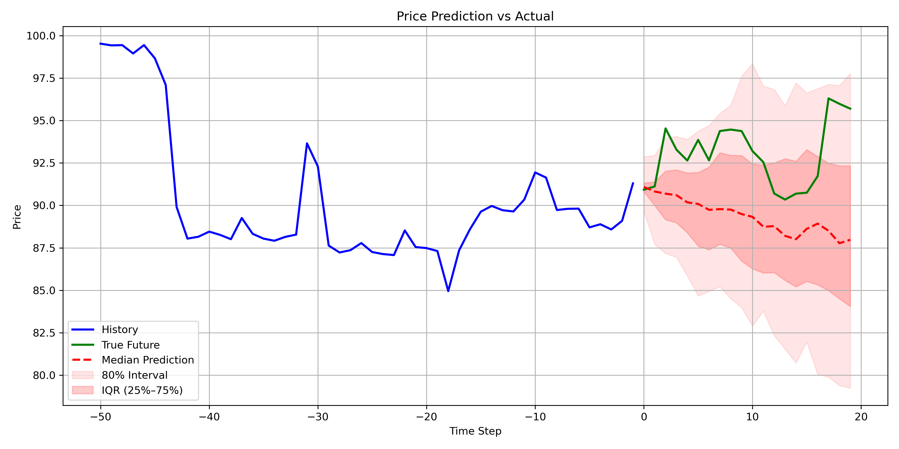

# Wavelet Diffusion for Probabilistic Time-Series Forecasting

This project studies a diffusion model for probabilistic forecasting of financial time series.
The model combines a Transformer score network with a stationary wavelet transform (SWT).
The wavelet representation separates a time series into components at multiple temporal scales.
The diffusion process generates plausible future trajectories from noisy wavelet coefficients.

The repository contains the model, training code, inverse-SWT reconstruction, rolling-origin evaluation, baseline methods, and unit tests.
The current-code five-epoch run validates the pipeline only.
It does not provide a final estimate of model quality.

## 1. Introduction

Time-series forecasting estimates future observations from a finite history.
Financial time series make this task difficult because they contain noise, changing volatility, and weakly stable temporal structure.
Point forecasts hide this uncertainty by returning one trajectory.
Probabilistic forecasts represent uncertainty with an ensemble of future trajectories.

Diffusion models provide one approach to probabilistic generation.
They define a forward process that gradually adds noise to data, then learn a reverse process that removes noise.
The reverse process starts from Gaussian noise and produces samples from the learned data distribution.
This project applies that idea to future windows of a time series.

The project uses wavelets because temporal patterns occur at different scales.
An SWT decomposes a signal into detail bands and a coarse approximation band.
The model predicts all future bands, then reconstructs the future signal with the inverse SWT.

The forecast is conditional because the model receives the observed history as context.
Let $c = \mathcal{W}(y_{1:H})$ denote the wavelet representation of the history.
Let $z_0 = \mathcal{W}(y_{H+1:H+K})$ denote the clean future coefficients.
The model targets the conditional distribution:

$$
p_\theta\left(y_{H+1:H+K} \mid y_{1:H}\right)
\quad\text{through}\quad
p_\theta\left(z_0 \mid c\right).
$$

At diffusion time $t$, the conditional score function is:

$$
s_\theta(z_t,t,c)\approx\nabla_{z_t}\log p_t(z_t \mid c).
$$

This score gives the denoising direction for the noisy future coefficients $z_t$.
The history context $c$ guides every reverse-SDE step toward futures that match the observed series.
The inverse SWT maps each generated coefficient sample back to a future trajectory.



*Figure 1. The conditional score network uses the observed history to guide the reverse-SDE trajectory from noise to forecast samples.*

## 2. Score-based diffusion background

Score-based modeling represents a probability distribution through the gradient of its log density.
For a random variable $z$ with density $p(z)$, the score function is:

$$
s(z) = \nabla_z \log p(z).
$$

The score points toward regions of higher probability.
It provides a useful representation because the gradient removes any constant normalizing factor in $p(z)$.
The neural network therefore learns a vector field instead of predicting a normalized density.
This score-based view follows the formulation described by [Song (2021)](https://yang-song.net/blog/2021/score/).

The data distribution is perturbed with a continuous noise process:

$$
\mathrm{d}z = f(z,t)\,\mathrm{d}t + g(t)\,\mathrm{d}w,
$$

where $f$ is the drift, $g$ controls the noise magnitude, and $w$ is Brownian motion.
At $t=0$, $z$ follows the data distribution.
At a sufficiently large terminal time $T$, $z_T$ approaches a tractable Gaussian prior.

The network learns the time-dependent conditional score:

$$
s_\theta(z_t,t,c)
\approx
\nabla_{z_t}\log p_t(z_t \mid c).
$$

For a perturbation written as $z_t = \alpha(t)z_0 + \sigma(t)\epsilon$, with $\epsilon \sim \mathcal{N}(0,I)$, denoising score matching uses the Gaussian conditional score target:

$$
\nabla_{z_t}\log q(z_t \mid z_0) = -\frac{\epsilon}{\sigma(t)}.
$$

The training objective compares the neural score with this target across noise times and forecast contexts:

$$
\mathcal{L}_{\mathrm{score}}= \mathbb{E}_{t,z_0,\epsilon}\left[\lambda(t)\left\|s_\theta(z_t,t,c) + \frac{\epsilon}{\sigma(t)}\right\|_2^2\right].
$$

The reverse-time SDE uses the learned score to remove noise:

$$
\mathrm{d}z= \left[f(z,t) - g(t)^2 s_\theta(z,t,c)\right]\mathrm{d}t  + g(t)\,\mathrm{d}\bar{w},\qquad \mathrm{d}t < 0.
$$

The sampler starts with $z_T$ drawn from Gaussian noise and integrates this equation backward to $t=0$.
The context $c$ stays fixed during sampling, so it guides the score at every denoising step.
This procedure turns a noise sample into a future trajectory conditioned on the observed history.

For the variance-preserving SDE used by this project, the drift and diffusion coefficients are:

$$
f(z,t) = -\frac{1}{2}\beta(t)z,\qquad g(t) = \sqrt{\beta(t)}.
$$

The corresponding perturbation has the form:

$$
z_t = \exp\left(-\frac{1}{2}\int_0^t \beta(u)\,\mathrm{d}u\right)z_0      + \sqrt{1-\exp\left(-\int_0^t \beta(u)\,\mathrm{d}u\right)}\,\epsilon.
$$

This parameterization connects the continuous SDE to the familiar discrete diffusion schedule.
Small values of $t$ preserve more information from $z_0$.
Large values of $t$ produce samples that approach Gaussian noise.



*Figure 2. A visual analogy for the forward diffusion process.*
The figure uses a video-like frame to show progressive noise addition.
This project applies the same process to numerical time-series windows and wavelet coefficients.

## 3. Wavelet representation

For an input window $y \in \mathbb{R}^{L}$, the level-four SWT with the Daubechies-4 wavelet produces four detail bands and one approximation band:

$$
\mathcal{W}(y) = \left[cD_1, cD_2, cD_3, cD_4, cA_4\right].
$$

The transform preserves the time-aligned structure of the signal.
The detail bands represent changes at different scales.
The approximation band represents the coarser signal structure.
The implementation pads windows to a length divisible by $2^4$ when required.
The inverse SWT removes this padding after reconstruction.

The model receives tensors with shape $[N, L, 5, 1]$.
Here, $N$ is the number of windows, $L$ is the window length, and the five bands are the wavelet channels.
The model predicts the future portion of every band.
The inverse transform combines the predicted bands into a forecast in the original signal domain.

## 4. Conditional forecasting model

Given a history window $y_{1:H}$, the model generates samples for the future horizon $y_{H+1:H+K}$.
The Transformer score network receives the observed history, noisy future coefficients, diffusion time, and guidance information.
The reverse SDE generates a sample of future wavelet coefficients.
The inverse SWT maps that sample back to the signal domain.

For each sampled coefficient trajectory $\hat{z}_0^{(m)}$, the forecast is reconstructed as:

$$\hat{y}_{H+1:H+K}^{(m)}= \mathcal{W}^{-1}\left(\hat{z}_0^{(m)}\right),\qquad m = 1,\ldots,M.
$$

The resulting ensemble approximates the conditional forecast distribution:

$$
\{\hat{\mathbf{y}}_{H+1:H+K}^{(m)}\}_{m=1}^{M}
\overset{\mathrm{i.i.d.}}{\sim}
p_\theta(
\mathbf{y}_{H+1:H+K} \mid \mathbf{y}_{1:H}
).
$$

The training objective combines a score-matching term with a multiscale reconstruction term:

$$
\mathcal{L}= \mathcal{L}_{\mathrm{score}}  + \lambda_{\mathrm{wavelet}}\mathcal{L}_{\mathrm{wavelet}}
$$

The score term trains the diffusion model to estimate the denoising direction.
The wavelet term preserves consistency across the predicted frequency bands.
The implementation uses a variance-preserving SDE and a Transformer score network.

The multiscale term compares the reconstructed coefficients with the observed future coefficients:

$$
\mathcal{L}_{\mathrm{wavelet}}
= \left\|
\hat{z}_0 - \mathcal{W}\left(y_{H+1:H+K}\right)
\right\|_2^2.
$$

During sampling, an Euler–Maruyama step for reverse time uses a negative step size $\Delta t$:

$$
z_{t+\Delta t}= z_t + \left[f(z_t,t)-g(t)^2s_\theta(z_t,t,c)\right]\Delta t + g(t)\sqrt{|\Delta t|}\,\xi_t,\qquad \xi_t\sim\mathcal{N}(0,I).
$$



## 5. Qualitative results

Figure 3 shows the full price and wavelet-band history.
The vertical split separates the training and test ranges.
The lower panels show the detail and approximation bands used by the model.



*Figure 3. The Bitcoin price series, daily log returns, and five wavelet bands.*

The following examples show historical prediction outputs.
The blue line shows the history, the green line shows the true future, and the red dashed line shows the median prediction.
The shaded regions show the 80% interval and the interquartile range.
These figures demonstrate the forecast and uncertainty visualizations produced by the project.
They are qualitative historical outputs, not a controlled final benchmark.

| Forecast example | Artifact |
| --- | --- |
| Window 816 |  |
| Window 834 |  |
| Window 453 |  |

## 6. Reproducibility

Create the Conda environment and install the package:

```bash
conda env create -f environment.yml
conda activate wavelet-diff
pip install -e .
```

Run the tests and linter:

```bash
ruff check src data tests
pytest -q
```

Train the bounded CPU pilot:

```bash
python -m src.model.trainer --config configs/current_cpu_pilot.json
```

Run the rolling-origin baseline evaluation:

```bash
python -m src.benchmarks.rolling_baselines \
  --input data/Testing\ Data/bitcoin_raw_prices_test.csv \
  --output outputs/baseline_metrics.csv
```

Run model evaluation after training a compatible current-code checkpoint:

```bash
python -m src.benchmarks.model_rolling_evaluation \
  --checkpoint outputs/checkpoints/current_model.pth \
  --output outputs/model_metrics.csv
```

## 7. Limitations

The repository does not include a final current-code model quality table.
The available current-code run uses five epochs and acts as a pipeline smoke test.
The historical checkpoints require the historical model implementation because their parameter shapes do not match the current architecture.
Training and prediction require local data that the repository does not store.

## References

1. Ho, J., Jain, A., and Abbeel, P. *Denoising Diffusion Probabilistic Models*. 2020. [arXiv:2006.11239](https://arxiv.org/abs/2006.11239).
2. Nason, G. P. and von Sachs, R. *Wavelet Processes and Adaptive Estimation of the Evolutionary Wavelet Spectrum*. 1999. [Biometrika](https://doi.org/10.1093/biomet/86.4.873).
3. Song, Y. *Generative Modeling by Estimating Gradients of the Data Distribution*. 2021. [Score-based modeling overview](https://yang-song.net/blog/2021/score/).

## License

This project is licensed under the MIT License. See [LICENSE](LICENSE).
